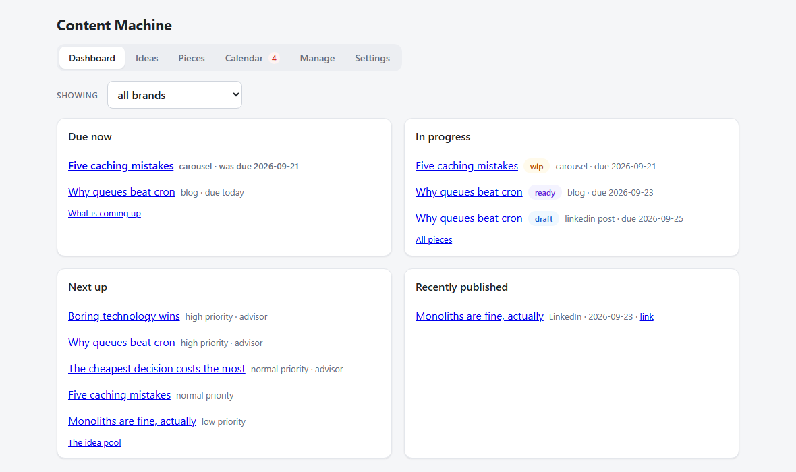
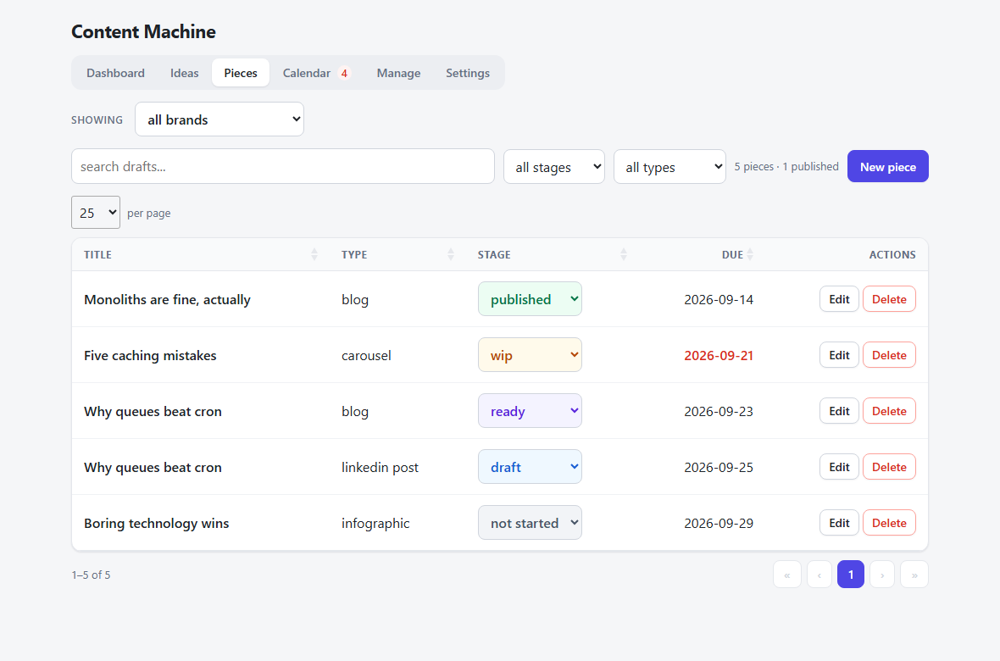
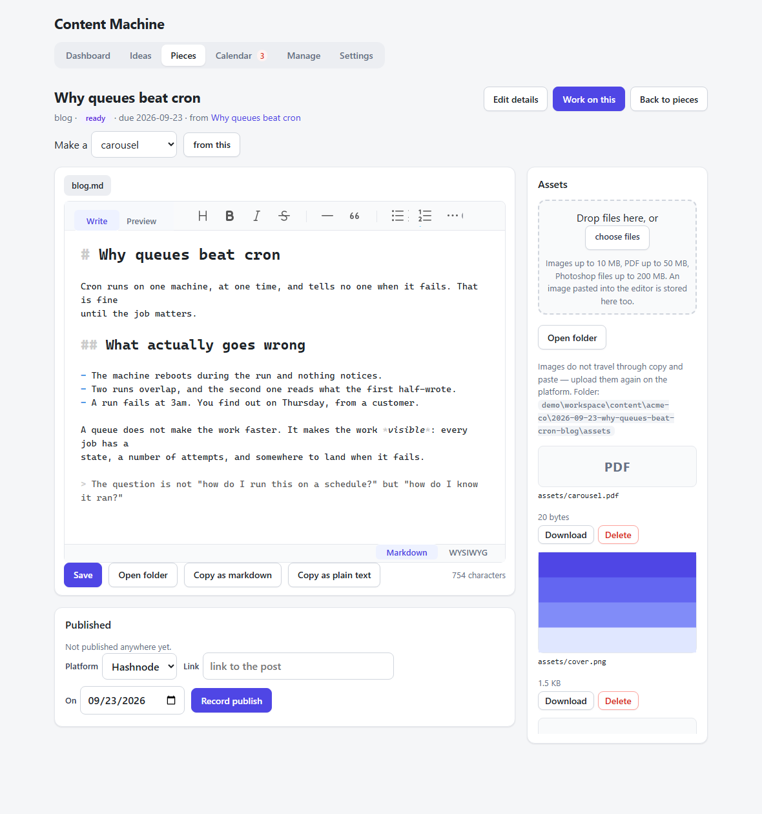
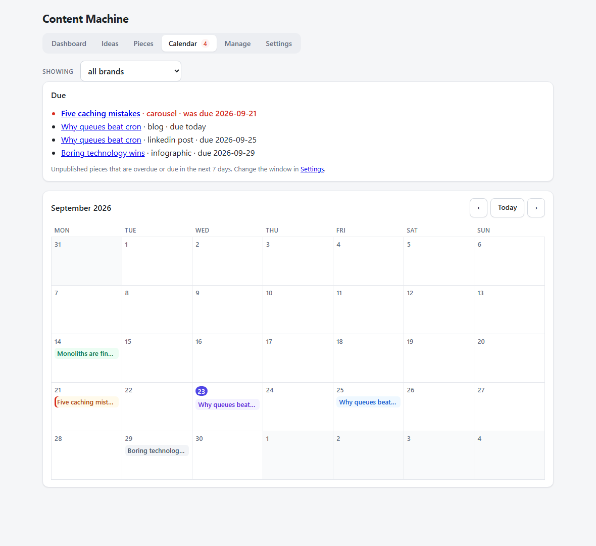
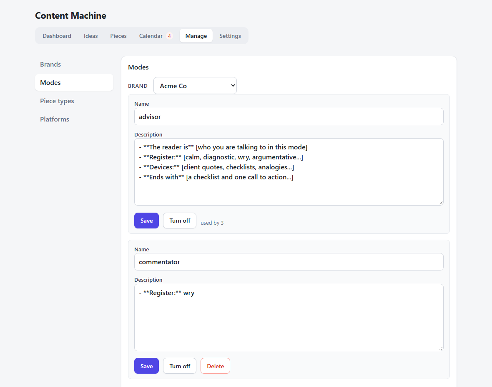
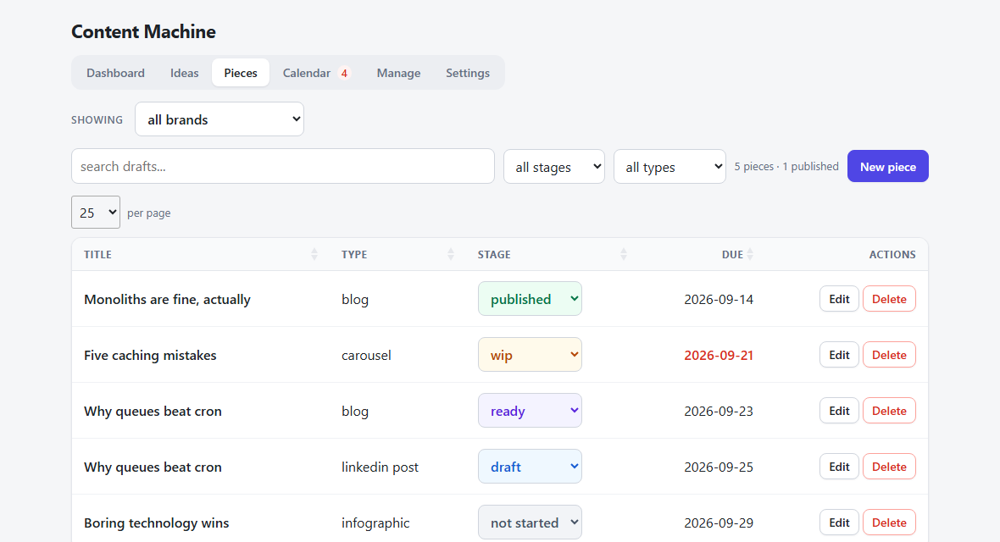
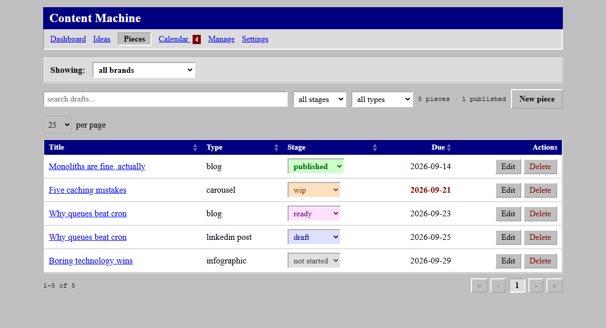
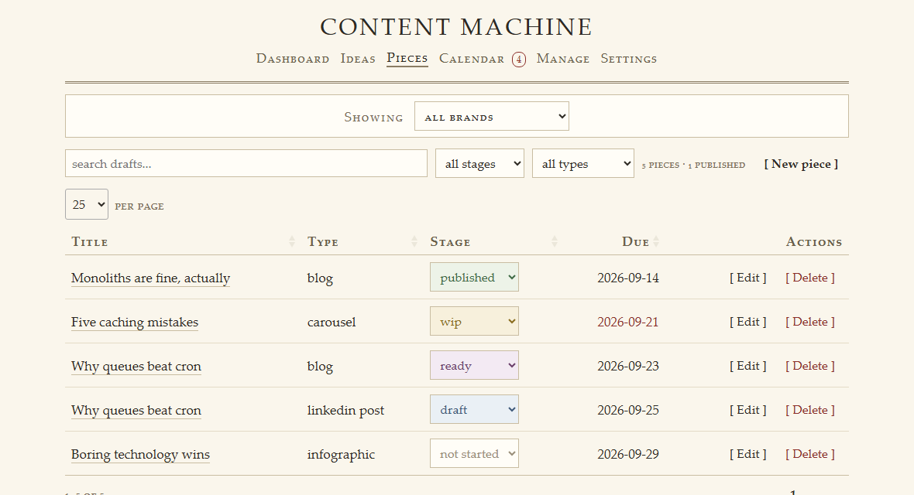

# Content Machine

A local tool for running a content pipeline: an idea pool, the pieces made from each idea,
and the state of each one on its way to being published. Everything runs on your machine and
nothing is sent anywhere.

It replaces a Notion database, so it has to do three things Notion could not: work offline,
raise its own reminders, and sit next to the files and generation steps that produce the work.

## What it looks like

The screenshots show made-up brands and content; real work never leaves the workspace.

**Dashboard** — what is due now, what is in progress, what to start next, what went out last.



**Pieces** — every piece with its stage, paged and sortable, with a search that looks inside
the drafts themselves.



**A piece** — its drafts in a markdown editor, the files that go with it in a sidebar, and
where it was published underneath.



**Calendar** — what is due, then the month laid out by due date, coloured by stage.



**Manage** — brands with their voice and profile, each brand's modes, piece types, platforms.



## Running it

```sh
uv sync --extra dev   # exact versions from uv.lock, into .venv

cm init           # create the workspace: session rules and skills
cm serve          # this machine only
cm serve --lan    # also reachable from a phone on the same network
cm where          # show the workspace paths
```

To have `cm` in every terminal, not only with the `.venv` active, register it:

```sh
./install.sh                  # Linux, macOS, Git Bash
.\install.ps1                 # Windows PowerShell
```

Both wrap `uv tool install --editable` and `uv tool update-shell`: `cm` gets its own
environment in uv's tool folder, and that folder goes on PATH. The install is editable, so it
runs the code in this repo (a `git pull` needs no reinstall) and the default workspace stays
`<repo>/workspace`. Options: `--uninstall` / `-Uninstall` removes it, `--no-path` / `-NoPath`
leaves PATH alone, `--native-tls` / `-NativeTls` uses the system's certificates on networks
that inspect HTTPS. If PowerShell blocks scripts: `powershell -ExecutionPolicy Bypass -File .\install.ps1`.

`cm init` copies the session rules and skills from `cm/starter/` into the workspace. Brands
are added under Manage in the app; a new brand's voice and profile start from the
placeholder templates in `cm/starter/brand/`. Real brands only ever live in the workspace
database, never in this repository.

The address printed on start carries a one-time token; the app refuses requests without it.

## How it is put together

| Concern | Choice | Why |
|---|---|---|
| HTTP | FastAPI + Uvicorn | Form validation, dependencies and streaming come with it; streaming matters for the generation step that comes next |
| Database | SQLite via SQLModel | One file, no server. SQLModel gives typed models over SQLAlchemy |
| Schema changes | Alembic | The database will hold real work, so changes have to migrate rather than be recreated |
| Pages | Jinja2 templates + htmx | Server-rendered fragments, no build step, no frontend framework for what is a CRUD screen |
| CLI | Typer | Same operations as the UI, without a browser |
| Editor | Toast UI Editor | Markdown and WYSIWYG in one component, with a toggle, and no build step |
| Paged lists | DataTables 3 | Paging, rows per page and column sorting on the lists, with no dependencies of its own; it keeps its place when htmx redraws a list |
| Tests | pytest + FastAPI TestClient | Covers the routes, the audit trail, file safety and the migrations |

htmx, the editor and DataTables are vendored in `cm/static/vendor/` so the app loads nothing from the
internet. Use the editor's `-all` build: the plain one expects ProseMirror to be supplied
separately.

## Writing

Each piece has a folder, and its drafts are plain markdown files in it. The browser and a
terminal session read and write the same files, so there is no import or export.

- The editor is a textarea with Toast UI mounted on top. The textarea stays in the form, so
  saving works the same way if the editor fails to load.
- A save carries a fingerprint of the file it was given. If a session wrote to that file in
  the meantime, the save is refused and offers to reload or to overwrite deliberately.
- Pasted images are stored in the piece's `assets/` folder. The markdown keeps a relative
  path so the folder stays self-contained; the app serves the image for display.
- File routes only resolve names inside the piece's own folder.
- Unsaved typing is marked next to Save, Ctrl+S saves, and leaving the page or switching to
  another file asks first.
- A piece type can carry a character limit (LinkedIn's 3,000, X's 280). The count under the
  editor is of the text as "Copy as plain text" produces it, which is what the platform gets.
- Copying falls back to the older select-and-copy command where the clipboard API is not
  available, as on plain http from another device on the local network.

## Assets

A piece's images, PDFs (a LinkedIn carousel is posted as one), Photoshop files, video and
audio live in its `assets/` folder. They are uploaded through the browser, so they reach the
folder from any device: drop several files on the Assets panel, and download or delete them
from there. Video and audio play in the panel.

- Only these types are stored or served; limits are 10 MB for images, 50 MB for PDFs,
  200 MB for Photoshop files, 500 MB for video (MP4, WebM) and 50 MB for audio (MP3, M4A;
  WAV 200 MB). An HTML or SVG file is never served from the app's address.
- Each type is served with a content type the app states itself, not one read from the
  system, and video answers range requests so it can be scrubbed.
- Each upload is written under a temporary name and renamed once complete, so a failed or
  oversized upload leaves nothing behind.
- Deleting moves the file to `trash/<brand>/<piece folder>/assets/`.
- "Open folder" opens it in the file manager, and only appears on the machine running the app.

## Dashboard

The page the app opens on: what is due today or overdue, what is in progress, the pool ideas
to start next, and what went out last, each linking through. It follows the brand filter.

## Repurposing

"Make a … from this" on a piece's page makes a piece of another type with the same idea and
title, and remembers which piece it came from. Its brief names the source draft and asks the
session to use the `derive` skill; on the machine running the app a session opens straight
away.

## Layout

```
cm/
  app.py          application factory
  cli.py          the `cm` command
  routes/         page routes, one module per screen; htmx swaps the fragments
    manage/       the Manage tab, one module per section
  crud.py         database operations, shared by the web app and the CLI
  choices.py      the rules the managed lists share: unique names, turn off, delete if unused
  models.py       tables: brands, modes, piece types, platforms, ideas, pieces, publications
  scaffold.py     starter files for `cm init`, and the text new brands and modes begin with
  database.py     engine, sessions, foreign keys, migrate-on-start
  schedule.py     what is overdue or due soon
  month.py        a month laid out in weeks, with the pieces due on each day
  search.py       full-text search over the drafts (SQLite FTS5), kept in step with the files
  workspace.py    a piece's folder: where it is, its brief, moving it to the trash
  files.py        reading and saving drafts inside a piece folder
  assets.py       a piece's images, PDFs and Photoshop files: what is stored, and how
  terminals.py    opening a terminal session in a piece folder
  desktop.py      opening a folder in the system's file manager
  dates.py        stored UTC times to local calendar dates
  security.py     access token
  settings.py     configuration and workspace location
  templating.py   template setup and the context every page shares
  templates/      base page and htmx partials
  static/         base.css (layout), themes/ (appearance), vendor/
alembic/          migrations
tests/
workspace/        your content and the database (not in git)
```

## Themes

`static/base.css` holds structure and the responsive rules; a theme file holds only colours,
fonts and borders. Drop a stylesheet into `static/themes/` and it appears in the theme picker;
the choice is stored in the database, so it follows you to whatever device you open it on.

The same page in the three themes that ship with it — modern, 1996 and scholar:

| Modern | 1996 | Scholar |
|---|---|---|
|  |  |  |

## Data model

An **idea** is the unit of thinking. A **piece** is one thing that gets published — a blog post,
a LinkedIn post, a carousel — and an idea can produce several, each with its own type, stage and
due date. An idea can also stand alone as a single piece.

Stages: not started → draft → wip → ready → published.

**Piece types**, **platforms** and each brand's **modes** are lists you manage under the Manage
tab, not values in the code. Records point at them by id, so renaming one renames it everywhere.
Turning one off hides it from new choices while the records that use it keep it; one that is in
use cannot be deleted. Idea statuses, piece stages and priorities stay in code, because the app's
own behaviour depends on them.

A piece type can be marked **video**: its pieces are frames rendered into a video rather than
text pasted onto a platform, so it has no character limit. The "youtube short" type starts out
as one, opening on `frames.md`.

A brand's **voice** and **profile** are stored on the brand and edited on its Manage page. A
mode has a description. All three are copied into `brief.md` when a session starts, so the
database is their only home and a session still reads everything from one file.

Every status and stage change is written to the **events** table, so the history of a piece is a
record rather than a single current value: when it was drafted, when it became ready, when it went
out. Making a piece from an idea promotes that idea out of the pool, because it is now in motion.

The pieces list sorts by due date with undated work last, and marks anything overdue that has not
been published.

## Calendar and reminders

The Calendar tab lays a month out in weeks, starting on Monday, with each piece on its due day in
its stage's colour; published work stays on it. Months are plain addresses (`/calendar?month=2026-09`),
so they can be bookmarked. On a phone the grid becomes a list of the days that have something on them.

Unpublished pieces that are overdue, or due within a window set in Settings (a week by default),
are listed above the month on the Calendar tab and counted on that tab. There is no background process: the
reminder is wherever you already look.

## Searching drafts

"Search drafts" on the Pieces tab finds pieces by the words in their draft files, with word forms
("queue" finds "queues") and the last word allowed to be unfinished. A result opens the piece on
the file that matched.

Terminal sessions edit drafts directly, so the index catches up before every search, reading only
files whose size or modification time changed. It lives in `.cm/search.db` in the workspace, apart
from `content.db`: it holds nothing of its own, so deleting it only means the next search rebuilds it.

## Publishing

Recording a publish on a piece's page (platform, link, date) moves the piece to published. The
platform comes from the managed list, so the same one is always spelled the same way.
`cm published <id> --platform <name>` does the same from a terminal session.

## Deleting

Deleting a piece moves its folder to `trash/<brand>/` in the workspace, so deleting the entry never
deletes the work. If the folder cannot be moved — on Windows, while a terminal is open in it —
nothing is deleted and the page says why.

## Licence

MIT. See `LICENSE`.
